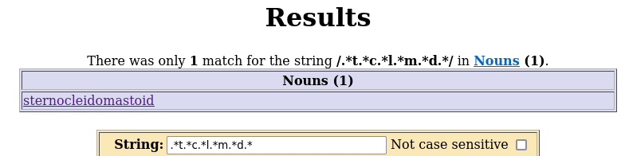

# Sternocleidomastoid
> The lightweight Markdown viewer

Sternocleidomastoid is a local Markdown renderer.

### Dependencies
* core C toolchain
* Tcl/Tk system installation
* tree-sitter[-markdown[-inline]] system installation
* X11
* [tbsp](https://github.com/agvxov/tbsp)

### Architecture
    +----------------------+                            +------------+
    | tbsp markdown parser | ---> highlevel script ---> | Tcl/Tk GUI |
    +----------------------+                            +------------+

### Configuration
#### GUI
The GUI uses Tcl/Tk.
Since its all scripting, there is no limit to the available customization.

There is a default GUI script embedded into the application,
which can be printed with the `--dump-script option`.
Due to the nature of Tcl, any function can be arbitrarily overwritten,
given a user script which can be specified as detailed below.
As implied, the user script is run after the embedded script,
but before processing the document.

#### Environment
Miscellaneous configuration options are all handled throught environment variables.
This is the ***correct*** way of handling a small number of configuration options,
in contrast to littering the user's home directory
and or pulling in a yaml dependency to store a single number on disk,
but I digress.

Available variables:
* `VIDEOPLAYER` is the preferred video player (+args) of the user
* `IMAGEVIEWER` is the preferred image viewer (+args) of the user
* `STERNOCLEIDOMASTOID_GRAPHICAL_USER_INTERFACE_SCRIPT` user script path

### Why?
I made Sternocleidomastoid because I could not find a single markdown viewer
which was both graphical and did not depend on a browser in an awkward way.

There are a good number of TUI markdown viewers.
***All of them are inferior*** to the perfect textual markdown viewer:
*(Your)* favourite editor.
However, the very core of the problem is, that markdown is more than text;
it can (and will) contain multimedia.
Until terminals cannot be reliably trusted with this task,
TUI viewers do not make sense.

The first kind of browser dependency is some Electron-esque solution.
Keeping it short and without spiraling off topic:
I find it unacceptable to ship an entire browser for the purpose.

The second kind of browser dependency simply renders to a html file.
In itself, this is fine, but its not user friendly.
A simple wrapper could be sufficient,
however all implementations I found had various quality problems.

As a side note, browsers are a portability, privacy and security nightmare.
However, I would not be against adding an alternative rendering mode to Sternocleidomastoid,
which creates a html file and invokes the user's preferred browser on it.

### Notes
The project produces a single binary.
Due to how closely Tcl integrates with C, we need not to fork.
A statically linked version is theoretically possible.

Sternocleidomastoid does not due live updates.
It is fast enough relaunch on file change,
but note that for the time being embeddings are volatile and unreliable,
so it might not be the best idea.

Parsing is handled by tree-sitter-markdown.
Tree-sitter-markdown -shortly put- is not great
and results in a number of limitations.
If there were a better TS grammar, I would use it.

Media, namely images and videos are rendered using embedded windows.
This divinely UNIX way of handling the question requires X11.

`VIDEOPLAYER` and `IMAGEVIEWER` are not in good taste,
however they are required until there is no proper default application managers
(think `xdg-open`, except not shit).
I estimate this will take an approximate 30 years to accomplish
for the *then* BSD community.

